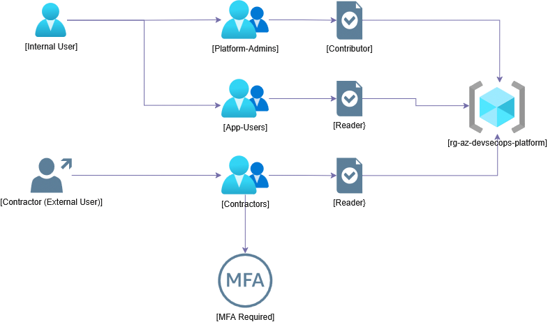

# Azure Zero Trust Platform

Terraform-built Azure infrastructure project focused on building a scalable Zero Trust foundation across identity, networking, and security controls.

## Goals
- Implement least-privilege RBAC
- Enforce secure network boundaries
- Automate infrastructure deployment using Terraform
- Align with cloud security frameworks

## Identity Design

This project uses group-based RBAC with Conditional Access enforcement.

See full design:
- docs/identity-design.md

## Structure
- terraform/: IaC
- README.md: Project overview and info

## Status
Initial structure in place