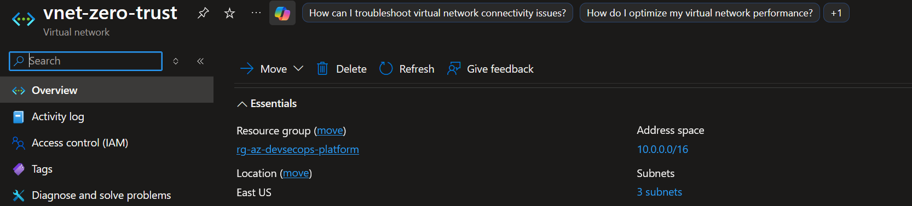
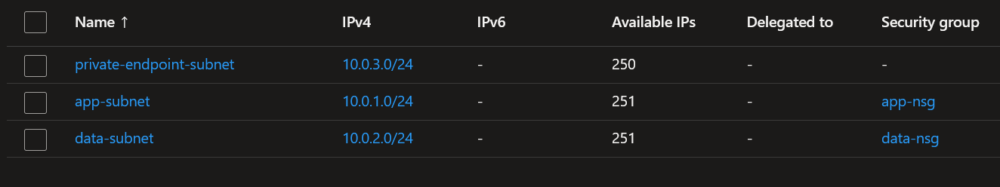
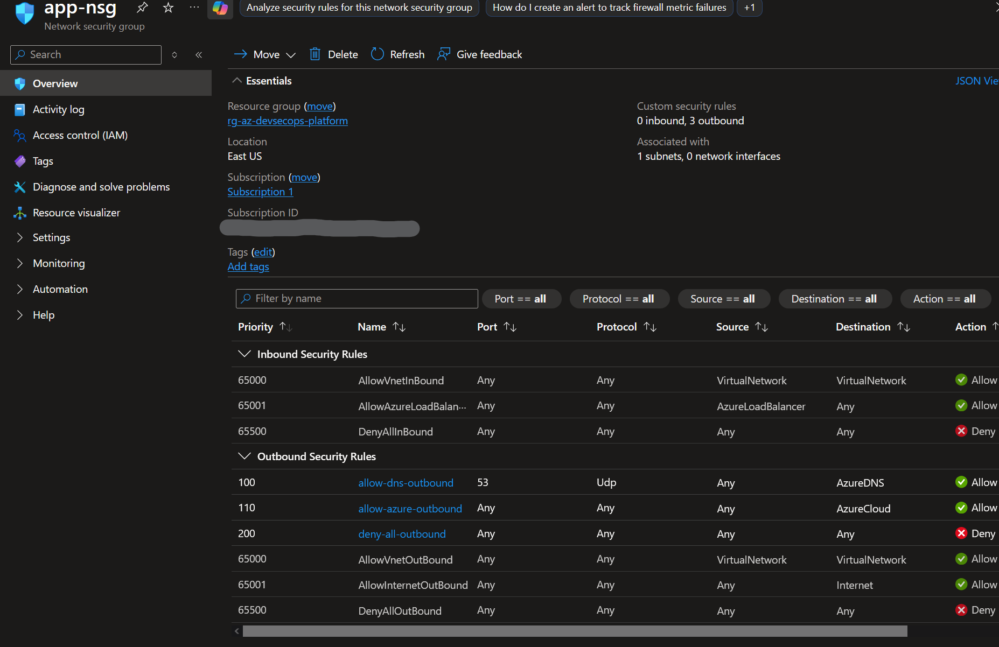
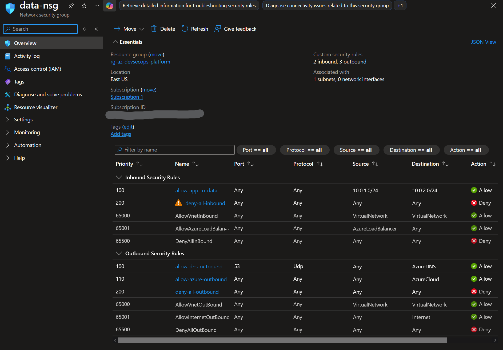
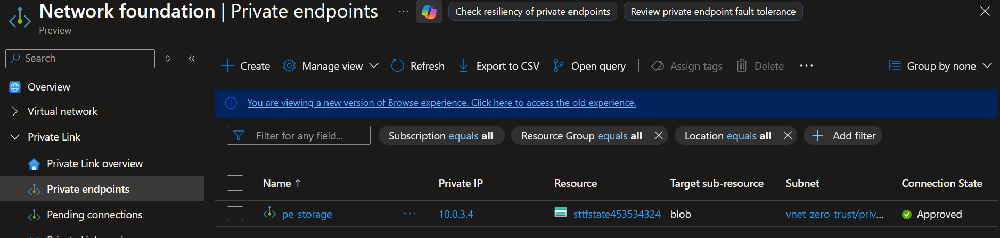
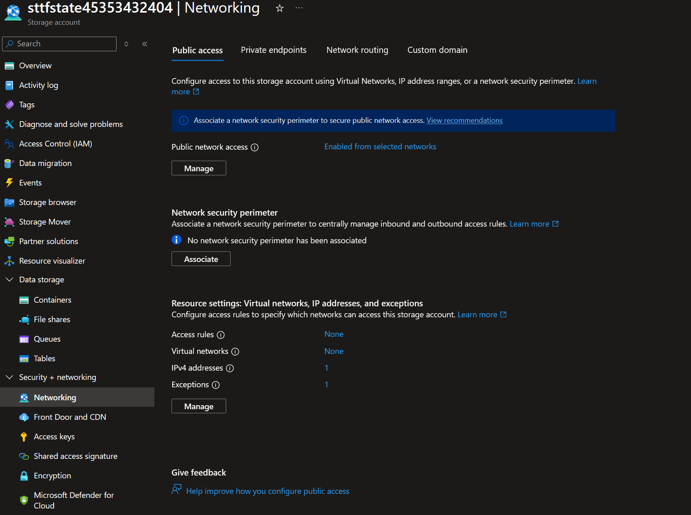

# Network Design — Networking Decisions

## Access Model

- Private endpoint used for secure storage access
- Public access to storage account restricted to trusted IP for terraform ops

## Constraints

- Terraform executed outside of VNet
- Full private-only requires moving terraform within vnet

## DNS Behavior

- Private DNS zone ensures internal resolution
- Validation requires in-VNet client (compute will be added later)

## Outbound Gap

- AzureCloud still allowed
- ToDo: controlled egress through firewall or NAT

## Architecture Evidence

